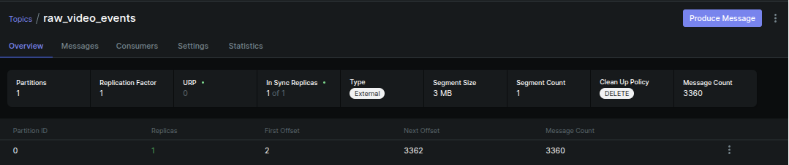
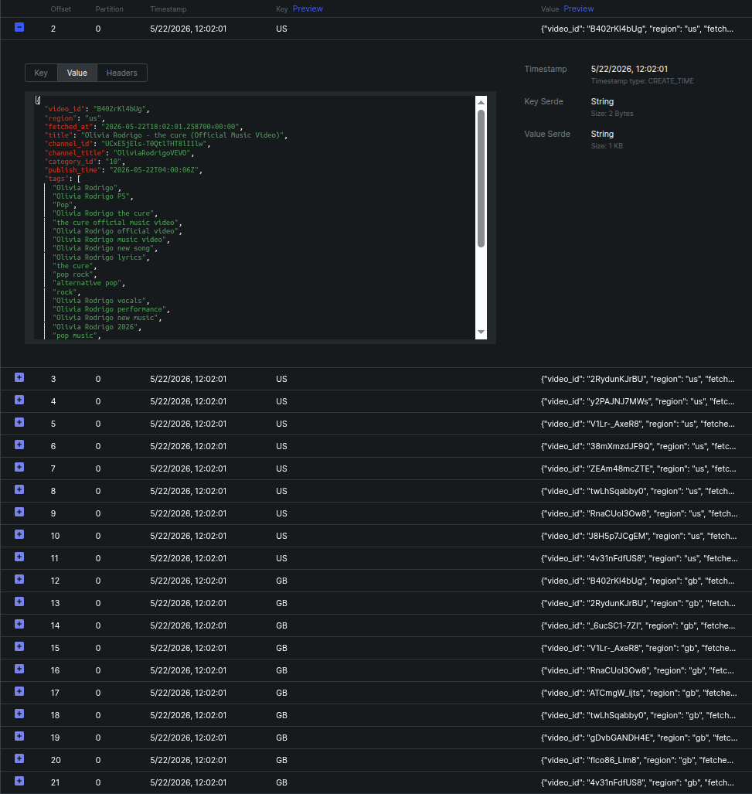
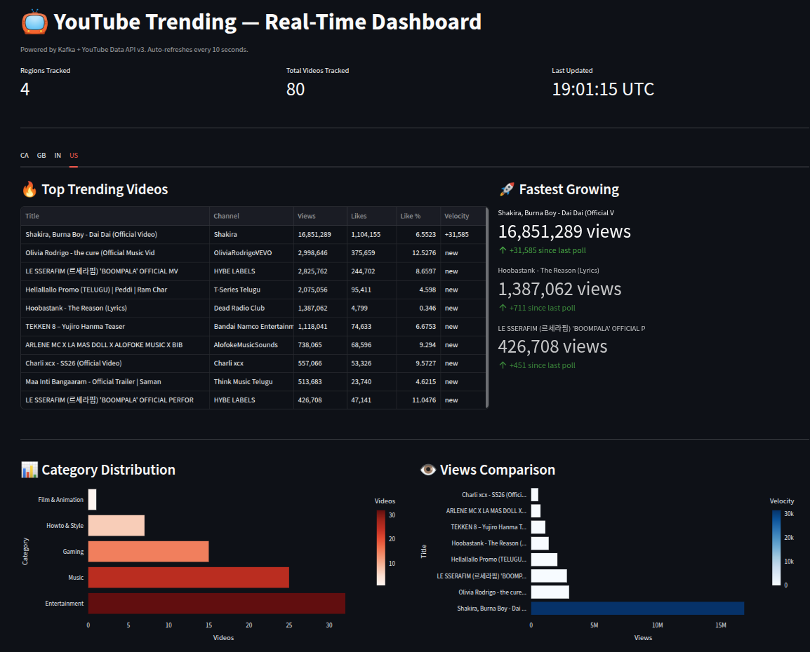
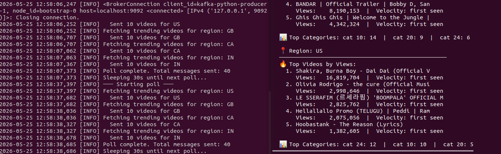

# YouTube Trending — Real-Time Kafka Pipeline

A real-time streaming pipeline that tracks YouTube trending videos 
using Apache Kafka, processes them with a stateful stream consumer, 
and visualizes results in a live Streamlit dashboard.

---

## Architecture

YouTube Data API v3 (every 2 min)
↓
Python Producer → Apache Kafka topic: raw_video_events
↓
Stream Processor Consumer → stateful aggregations (views, velocity, categories)
↓
Streamlit Dashboard → auto-refreshes every 10 seconds

---

## What it does

- **Polls** the YouTube Data API every 2 minutes for trending videos across 4 regions (US, GB, CA, IN)
- **Publishes** each video as a Kafka message keyed by region for partition ordering
- **Processes** messages in real time tracking view velocity (views gained between polls), category distribution per region and top trending videos per region
- **Visualizes** everything in a Streamlit dashboard that auto-refreshes

---

## Key concepts demonstrated

| Concept | Implementation |
|---|---|
| Kafka Producer | Serialization, keys, batching, acks |
| Kafka Consumer | Group ID, offset management, auto-commit |
| Stateful streaming | In-memory aggregations across polls |
| View velocity | Delta views between consecutive polls |
| Real-time dashboard | Streamlit + Plotly auto-refresh |

---

## Screenshots

### Kafka UI — Topic & Messages



### Live Dashboard


### Pipeline Running


---

## Prerequisites

- Python 3.8+
- Docker + Docker Compose
- YouTube Data API v3 key ([get one here](https://console.developers.google.com))

---

## How to run

**1. Clone the repo**
```bash
git clone https://github.com/raydesel/yt-kafka-pipeline.git
cd yt-kafka-pipeline
```

**2. Set up environment**
```bash
cp .env.example .env
# edit .env and add your YouTube API key
```

**3. Install Python dependencies**
```bash
pip install -r requirements.txt
```

**4. Start Kafka**
```bash
cd docker
docker compose up -d
cd ..
```

**5. Open three terminals**

Terminal 1 — Stream processor:
```bash
python src/stream_processor.py
```

Terminal 2 — Producer:
```bash
python src/youtube_producer.py
```

Terminal 3 — Dashboard:
```bash
streamlit run src/dashboard.py
```

**6. Open the dashboard**

Go to `http://localhost:8501`

Kafka UI is available at `http://localhost:8080`

---

## Project structure

├── src/
│   ├── youtube_producer.py    # Kafka producer — polls YouTube API
│   ├── stream_processor.py    # Kafka consumer — stateful processing
│   └── dashboard.py           # Streamlit real-time dashboard
├── docker/
│   └── docker-compose.yml     # Kafka + Zookeeper + Kafka UI
├── .env.example               # Environment variable template
├── requirements.txt
└── README.md

---

## Batch pipeline (AWS)

This project is the streaming extension of a full batch pipeline 
built on AWS using S3, AWS Glue, Lambda, Step Functions, 
Athena and SNS following medallion architecture (bronze → silver → gold).

[Link to AWS pipeline repo](https://github.com/raydesel/youtube-data-pipeline-2026)


